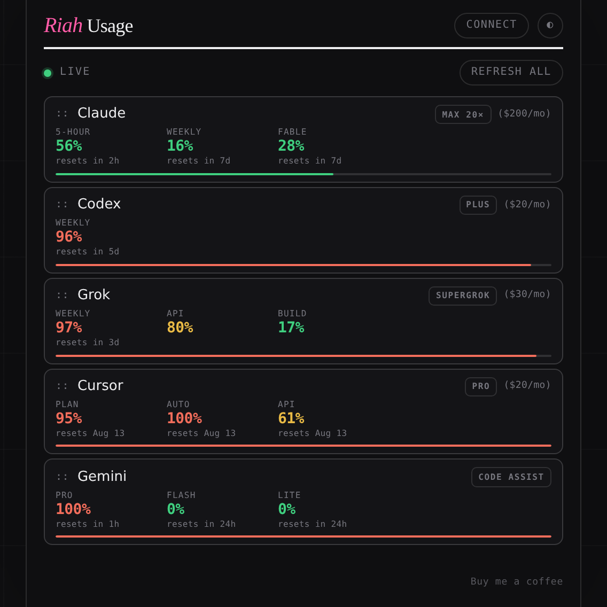
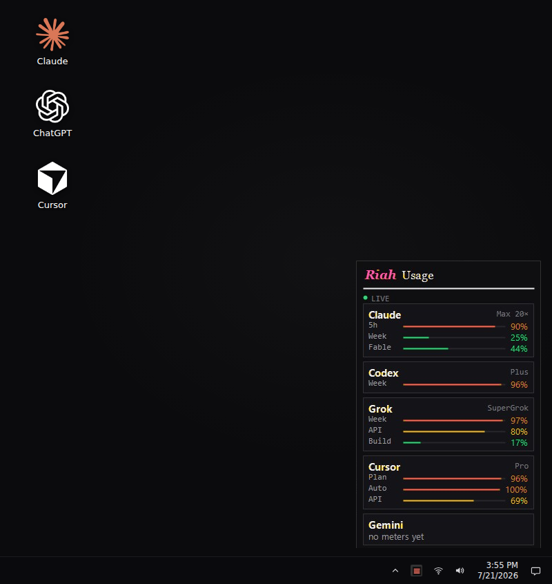

# Riah Usage

## Direct answer

**Riah Usage** is a free, local dashboard for AI subscription usage meters (Claude, Cursor, Codex, Grok, Gemini, Copilot, Kimi, and more). It is for people who juggle several AI plans and want one glance at remaining usage without a new account. Meters refresh on your machine; no telemetry. Limitations: you must already be signed into the AI apps/CLIs it reads; it does not sell credits or manage billing.


<p align="center">
  
  
</p>

**Free.** A local, one-glance dashboard for your AI subscription meters — Claude, Cursor, Codex, Grok, Gemini, Copilot, and Kimi — in a clean Ink/Mono UI.

Drag cards to put the AIs you care about first. Order sticks in your browser. No accounts, no cloud sync, no telemetry. Your logins stay on your machine.

## Requirements

- **Node.js** 18+ (one-time install from nodejs.org)
- **Python** 3 (for the Claude / Cursor / Gemini / Copilot / Kimi pulls)
  - Optional: `pip install browser-cookie3 pycryptodomex` — only the Gemini browser-cookie fallback uses these. The one-click **Sync Gemini** works without them.
- The AI apps/CLIs you already use, signed in:
  - Claude → Claude Code (`claude` then `/login`)
  - Cursor → Cursor desktop signed in
  - Codex → Codex CLI signed in
  - Grok → Grok Build CLI signed in
  - Gemini → Sync Gemini (one click; sign into Google only if asked)

No accounts with us. No API keys pasted into Riah Usage. No terminal left open while it runs.

## Quick start

```bash
git clone https://github.com/RiahStudio/riah-usage.git
cd riah-usage
npm install
npm start
```

Windows: double-click **`Start Riah Usage.bat`** (first run may install a small helper, then it stays quiet).  
macOS / Linux: `chmod +x start.sh && ./start.sh`

That starts the desk **in the background** (no browser popup) and refreshes meters about every 5 minutes. Open the full page from the tray menu when you want it. Nothing to leave open. To stop later: **`Stop Riah Usage.bat`**.

One-shot snapshot (no live loop): `npm run once` then open `index.html`.

## System tray (Windows)

The desk also puts a tiny live-meter icon down by the clock. **Hover** for a
compact peek with every percent. **Click** to pin a bigger panel with all bars
and meters (scroll if your screen is short). **Double-click** opens the full
page. **Right-click** for Refresh now / Start desk / Quit.

It starts automatically with the desk (zero extra installs — plain Windows
PowerShell). If you quit it, double-click **`Start Riah Usage Tray.bat`** to
bring it back. Don't want it at all? Set `RIAH_USAGE_NO_TRAY=1` before
starting. macOS / Linux: use the web page.

## Connect accounts (onboarding)

On first open you’ll see **Connect your AIs**:

1. **Check** every AI you use (Claude, Cursor, ChatGPT/Codex, Grok, Gemini, GitHub Copilot, Kimi).
2. **Continue** — we walk through them one by one.
3. For Gemini, **Sync Gemini** opens a sign-in window and finishes itself (no Check again).
4. For the others, sign in with their app/CLI, then tap **I'm signed in — Continue**.

We never ask for passwords or API keys. Tap **Connect** anytime later to add more.

## Optional tip

Being upfront: the footer carries a quiet “Buy me a coffee” link, and it points at
me. That's the only outbound link in the app and the only ask in the whole project.
Forking it for yourself? Put your own page in `config.js`, or set that line to `""`
and the link disappears.

## What you get

| AI | Meters |
|----|--------|
| Claude | 5-hour · Weekly · Fable (and other scoped windows) |
| Gemini | Current usage · Weekly limit |
| Cursor | Plan · Auto · API |
| Codex | Weekly (+ 5-hour when ChatGPT returns it) |
| Grok | Weekly · product splits |
| Copilot | Credits · Chat · Completions (plan-dependent) |
| Kimi | Kimi for Coding windows (weekly / 5-hour, plan-dependent) |

Plan name + list price show on each card (e.g. Max 20× · $200/mo) so you don’t have to memorize tiers. This dashboard itself is free.

You choose what shows: in **Connect**, use the **Shown on the board** checkboxes. Unchecked meters stay connected — they just leave the main list.

## Missing an AI?

We'd love to cover them all — we just haven't built the rest yet. The desk only reads sign-ins that already live on your computer, so the AIs that live in the browser (Perplexity, Midjourney, Suno, ElevenLabs, Runway…) each need their usage page taught the same one-click Sync trick Gemini uses. Buildable — just not built.

[docs/providers.md](docs/providers.md) maps where every popular AI stands today. Want one sooner? Feel free to build it and send a PR. Only house rule: no API keys, no passwords, meters only.

## Privacy

- Collectors talk only to each provider’s own usage API using tokens already on disk.
- Tokens are never printed or written into `usage-data.js`.
- Generated data (`usage-data.js`, `scratch/`) is gitignored.

See `docs/providers.md` for the pull map.

## Fork / your own copy

This folder is self-contained. Fork on GitHub, set your own tip URL in
`config.js` if you want, then `npm start`. Your local meter snapshot
(`usage-data.js`) stays on your machine and is gitignored.

## From the maker

This is a vibe-coded project — I'm not a real developer and probably won't become one. It's just something cool I wanted for myself, to make my life easier, so I made it. I would love feedback if it's not too technical or aggressive 😅.
Hope you guys like it!

## License

MIT — free to use, fork, and ship. Keep the license file. Bundled fonts are under the SIL Open Font License (see `assets/fonts/`).
